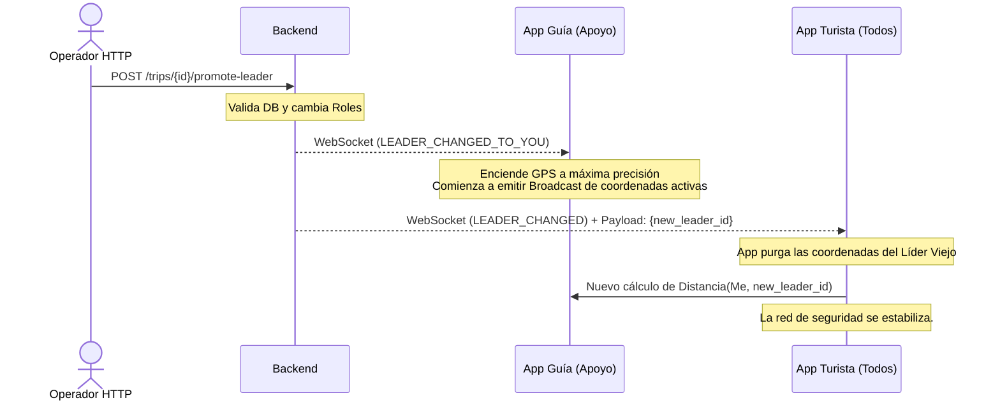

# Documentación de Historias de Usuario: Portal de Agencia (Escritorio)

## Introducción
Este documento contiene las historias de usuario correspondientes al **Portal de Agencia (Escritorio)** del sistema OthliAni. Aquí se detalla la funcionalidad que permite a los administradores y operadores logísticos de las agencias de turismo gestionar viajes, configurar parámetros de seguridad, monitorear a los grupos en tiempo real y acceder a herramientas de análisis y control de personal.

## Roles
* **Administrador de Agencia:** Usuario con privilegios completos para configurar cuestiones administrativas, de facturación, suscripciones, y personal (guías).
* **Operador Logístico:** Usuario orientado al monitoreo en tiempo real de los viajes "en curso", triaje y gestión de incidentes y crisis.

## Índice
1. [Matriz de Historias de Usuario](#matriz)
2. [AGEN-US01: Creación de Itinerarios por Importación y Asignación Diferida](#agen-us01)
3. [AGEN-US02: Parametrización Estratégica del Viaje](#agen-us02)
4. [AGEN-US03: Dashboard de Monitoreo Táctico y Gestión por Excepción (Mapa Global)](#agen-us03)
5. [AGEN-US04: Panel de Alertas Escaladas y Comunicación de Soporte (Chat con Guías)](#agen-us04)
6. [AGEN-US05: Panel Health Check (Batería, Conectividad y Último Ping)](#agen-us05)
7. [AGEN-US06: Panel de Analítica, KPIs de Rendimiento y Auditoría Post-Viaje](#agen-us06)
8. [AGEN-US07: Gestión de Personal (Catálogo y Control de Acceso de Guías)](#agen-us07)
9. [AGEN-US08: Configuración de Agencia y Gestión de Suscripción (SaaS B2B)](#agen-us08)
10. [AGEN-US09: Gestión de Crisis](#agen-us09)
11. [AGEN-US10: Gestión del Ciclo de Vida y Edición Dinámica del Itinerario en Vivo](#agen-us10)
12. [Glosario de Términos](#glosario)

## Matriz de Historias de Usuario

| ID | Resumen | Perfil(es) | Prioridad |
| :--- | :--- | :--- | :--- |
| **[US01](#agen-us01)** | Importación Masiva e Inyección Diferida | Admin | 🔴 Alta |
| **[US02](#agen-us02)** | Parametrización de Reglas de Seguridad | Admin | 🔴 Alta |
| **[US03](#agen-us03)** | Dashboard de Monitoreo Global / Mapa | Admin, Operador | 🔴 Alta |
| **[US04](#agen-us04)** | Alertas y Chat Lateral (Soporte Rápido) | Admin, Operador | 🔴 Alta |
| **[US05](#agen-us05)** | Health Check: Conectividad y Batería | Admin, Operador | 🟢 Baja |
| **[US06](#agen-us06)** | Panel de KPIs, Evaluaciones y Auditoría PDF | Admin | 🟢 Baja |
| **[US07](#agen-us07)** | Catálogo de Guías y Soft Delete | Admin | 🟡 Media |
| **[US08](#agen-us08)** | Suscripción SaaS (Configuración de Agencia) | Admin | 🟢 Baja |
| **[US09](#agen-us09)** | Kill-Switch de Dispositivo y Promoción de Guía Líder | Admin, Operador | 🔴 Alta |
| **[US10](#agen-us10)** | Edición Dinámica de Itinerario en Curso | Admin, Operador | 🟡 Media |

[⬆️ Volver al Índice](#indice)

---

## AGEN-US01: Creación de Itinerarios por Importación y Asignación Diferida
**ÉPICA: Portal de Agencia (Escritorio)**

### 1. Valor de Negocio

**Como** Administrador de Agencia  
**Quiero** poder crear un viaje importando un archivo existente (Excel/CSV) y tener la flexibilidad de agregar turistas gradualmente a lo largo del tiempo.  
**Para** reducir drásticamente el tiempo de captura de datos manual, evitar errores de transcripción y adaptar la logística al ritmo real de las ventas de la agencia.  

---

### 2. Criterios de Aceptación

#### Escenario A: Importación Masiva de Itinerario
* **Dado que** estoy en el módulo "Gestor de Viajes" creando un nuevo viaje,
* **Cuando** selecciono la opción "Importar desde archivo" y subo un archivo (Excel/CSV) con columnas estándar (Fecha, Hora, Actividad, Dirección),
* **Entonces** el sistema debe procesar el archivo, geocodificar las direcciones usando *Google Places API*, y poblar el mapa híbrido y la lista de *Actividad Instancias* automáticamente.
* **Y** me debe permitir arrastrar y soltar (Drag & Drop) los pines en el mapa para afinar la ubicación exacta del punto de reunión.

#### Escenario B: Validación Suave de Traslados (Advertencia) (Opcional)
* **Dado que** el itinerario importado o manual tiene múltiples actividades,
* **Cuando** la Actividad B está programada a una hora que no permite el tiempo físico de traslado desde la Actividad A (según el motor de Google Maps),
* **Entonces** el sistema no me bloqueará, pero marcará la Actividad B en color naranja y mostrará una advertencia: *"Revisión sugerida: El tiempo de traslado estimado es de 45 mins, pero solo hay 15 mins entre actividades"*.

#### Escenario C: Inyección de Pasajeros y Folios Nominativos
* **Dado que** el itinerario está listo,
* **Cuando** subo la "Lista de Pasajeros" (CSV con Nombre, Correo, Teléfono, Riesgos Médicos) en la pestaña de gestión del viaje,
* **Entonces** el sistema debe generar para cada pasajero un código único de un solo uso.
* **Y** me debe permitir exportar esta lista o enviar correos automáticos de invitación con el folio correspondiente a cada turista.

---

### 3. Diseño y UX

* **Layout del Gestor:** Diseño de pantalla dividida. Lado izquierdo: Lista de actividades tipo *Timeline* (arrastrable para cambiar orden). Lado derecho: Mapa interactivo (Google Maps) a pantalla completa.
* **Componente de Importación:** Un área amplia de *"Dropzone"* que acepte `.xlsx` y `.csv`. Al subir, mostrar un *Loader* amigable.
* **Gestión de Pasajeros:** Pestaña independiente dentro del viaje llamada "Pasajeros". Debe mostrar una tabla que muestre el estado del Folio:
  - 🟡 *Pendiente:* Folio OHTLI-JUAN-8X2 (El turista aún no descarga la app).
  - 🟢 *Activo:* Juan Pérez (El turista ya quemó el folio, creó su contraseña y aceptó GPS).

---

### 4. Notas Técnicas

* **Frontend:** - Usar el paquete `file_selector` para manejar la selección de archivos nativa en Windows/macOS.
  - Usar la librería `csv` o `excel` de Dart para parsear el archivo localmente antes de enviarlo al backend, reduciendo la carga del servidor.
* **Backend:**
  - Endpoint `POST /trips/import`.
  - Crear un adaptador que traduzca las filas del Excel a nuestra tabla de base de datos `actividad_instancias`.
* **Mapas:** - Para evitar saturar nuestra cuota de facturación de Google API al importar Excels grandes de golpe, implementar un retraso (debounce/throttle) en el geocoding en lote.
* **Base de Datos:**
  - La tabla `viajes` se crea primero, y los turistas se insertan posteriormente en la tabla `participantes_viaje` usando la relación.
  - El campo `folio_acceso` en la tabla `participantes_viaje` es la llave maestra para la auto-asignación diferida de la App Turista.

[⬆️ Volver al Índice](#indice)

## AGEN-US02: Parametrización Estratégica del Viaje
**ÉPICA: Portal de Agencia (Escritorio)**

### 1. Valor de Negocio

**Como** Administrador de Agencia  
**Quiero** configurar las reglas de seguridad de un viaje (distancia máxima permitida y tiempo de tolerancia de desconexión) usando perfiles predefinidos o ajustes manuales.  
**Para** adaptar el nivel de monitoreo al tipo de destino (urbano vs. remoto), garantizando la seguridad del turista sin abrumar al guía con alertas innecesarias.  

---

### 2. Criterios de Aceptación

#### Escenario A: Uso de "Perfiles de Entorno"
* **Dado que** estoy en las Reglas de Seguridad de un viaje nuevo,
* **Cuando** selecciono el tipo de entorno de una lista desplegable (Ej. "Urbano/Ciudad", "Naturaleza/Trekking", "Tiempo Libre/Compras"),
* **Entonces** el sistema debe autocompletar los parámetros globales del viaje con valores recomendados:
  - *Urbano:* Distancia Máx = 500m | Desconexión = 5 min.
  - *Trekking:* Distancia Máx = 100m | Desconexión = 30 min (por mala señal).
  - *Tiempo Libre:* Distancia Máx = 2000m | Desconexión = 15 min.
* **Y** debo poder sobreescribir estos valores manualmente.

#### Escenario B: Validación contra "Fatiga de Alertas"
* **Dado que** estoy ajustando manualmente los parámetros globales,
* **Cuando** configuro un "Tiempo de desconexión" excesivamente bajo (Ej. 1 minuto) o una distancia ilógica (Ej. 5 metros),
* **Entonces** el sistema debe mostrar una advertencia en naranja: *"Aviso: Las redes móviles suelen tener micro-cortes. Un tiempo menor a 3 minutos generará demasiadas alertas falsas para el guía."* o *"Aviso: 5 metros es la precisión estándar del GPS; esto generará alertas constantes."*

#### Escenario C: Jerarquía de Geocercas (Sobreescritura por Actividad)
* **Dado que** el viaje tiene una regla global de 500 metros de alejamiento,
* **Cuando** ingreso al detalle de una actividad específica (Ej. "Visita al Museo de Louvre") en el itinerario,
* **Entonces** el sistema debe permitirme definir un `radio_geocerca_mts` exclusivo para esa actividad (Ej. 200 metros).
* **Y** durante el horario de esa actividad, el motor de telemetría respetará la regla de la actividad (200m) por encima de la regla global (500m).

---

### 3. Diseño y UX

* **Visualización del Impacto (Preview Map):** Los controles para los metros de alejamiento no deben ser ciegos. Al modificar, un mini-mapa interactivo al lado debe mostrar un círculo (geocerca) creciendo o encogiéndose alrededor de un avatar de ejemplo, para que el administrador entienda *visualmente* cuánto son 300 metros en la escala de una ciudad.

* **Layout:** Esta configuración debe vivir dentro de la vista de creación/edición del viaje, en una pestaña dedicada con el ícono de un "Escudo" o "Engranaje de Seguridad".

---

### 4. Notas Técnicas

* **Modelo de Datos:**
  - Los parámetros globales se guardan en la tabla `viajes`.
  - Las excepciones de los hitos se guardan en `actividad_instancias`.

* **Sincronización hacia las Apps Móviles:**
  - Cuando el Guía y el Turista descargan el viaje, estos parámetros se guardan localmente en la base de datos del teléfono, esto ya que si el grupo pierde la señal de internet, el *Backend de Telemetría* no podrá disparar alertas. La *App Guía* y la *App Turista* deben usar estos parámetros locales para calcular distancias entre sí (si están conectados por P2P/WebRTC local o Bluetooth en el futuro) y alertar incluso en modo offline puro.

* **Motor de Telemetría:**
  - Cuando el viaje cambia a estado `EN_CURSO`, y se registre la lista de asistencia, el servicio de Telemetría en Node.js lee estos parámetros de PostgreSQL y los "cachea" en Redis.
  - El "Worker" de proximidad evaluará: `If (Distancia(Turista, Guia) > Limite_Actual) -> Disparar Evento`. La búsqueda de `Limite_Actual` debe ser ultra rápida en RAM (O(1) en Redis), verificando primero si la actividad actual tiene un radio específico, y si no, usando el global del viaje.

[⬆️ Volver al Índice](#indice)

## AGEN-US03: Dashboard de Monitoreo Táctico y Gestión por Excepción (Mapa Global)
**ÉPICA: Portal de Agencia (Escritorio)**

### 1. Valor de Negocio

**Como** Administrador de Agencia / Operador Logístico  
**Quiero** visualizar un mapa global interactivo que agrupe mis viajes activos y resalte únicamente aquellos que presentan anomalías (alertas, incidentes o desconexiones).  
**Para** tomar decisiones inmediatas, brindar soporte oportuno a mis guías en campo, y no sufrir "fatiga visual" ni distracciones con los viajes que operan con normalidad.  

---

### 2. Criterios de Aceptación

#### Escenario A: Renderizado Inicial y "Gestión por Excepción"
* **Dado que** abro la pantalla del Dashboard,
* **Cuando** el sistema carga los viajes en estado `EN_CURSO`,
* **Entonces** el mapa solo debe mostrar un marcador central por cada viaje (representado por la ubicación en vivo del Guía Líder).
* **Y** visualmente, los viajes sin problemas (Sanos) se mostrarán en un color gris/verde tenue o colapsados, mientras que los viajes con anomalías estarán resaltados.

#### Escenario B: Lista de Triaje Lateral (Panel de Atención)
* **Dado que** estoy observando el Dashboard,
* **Cuando** ocurre un evento (Ej. un turista sale de la geocerca),
* **Entonces** además del mapa, un panel lateral izquierdo ("Lista de Triaje") debe reordenarse automáticamente.

#### Escenario C: "Drill-Down" (Inspección Profunda de un Viaje)
* **Dado que** veo un viaje parpadeando en rojo en el mapa global,
* **Cuando** hago clic en el marcador de ese viaje o en su tarjeta de la lista de triaje,
* **Entonces** el mapa hace "Zoom-In" (Drill-down) a la región de ese viaje.
* **Y** la vista cambia de "Nivel Viaje" a "Nivel Turistas": ahora el mapa dibuja la geocerca actual (Ej. el radio del Museo), muestra el avatar del Guía, el clúster de turistas donde se resalten los que lleguen a registrar alertas.

#### Escenario D: Recuperación de la Normalidad
* **Dado que** un viaje registra alguna anomalía,
* **Cuando** el guía resuelve el incidente en su app,
* **Entonces** el Dashboard de la Agencia recibe el evento por WebSocket, el marcador del viaje vuelve a verde/gris, y la tarjeta baja de prioridad en la Lista de Triaje sin que el monitor de la agencia tenga que refrescar la página.

---

### 3. Diseño y UX

* **Jerarquía de Color:**
  > [!NOTE]
  > La paleta elegida busca evitar la fatiga visual del Operador Logístico.
  - 🟢 **Verde/Gris:** Todo Normal (Hito en tiempo, todos conectados). *Baja visibilidad visual intencional.*
  - 🟡 **Naranja:** Advertencias Tácticas (Guía desconectado por más de Y minutos, retraso en itinerario).
  - 🔴 **Rojo (Pulsante):** Crítico (Pánico, Emergencia Médica, Turista Desconectado).
* **Sin "Carga Infinita":** Implementar marcadores de clúster (Clustering) si hay muchos viajes en la misma ciudad para evitar superposición de íconos en el zoom global.

---

### 4. Notas Técnicas

* **Arquitectura de Red:** La vista principal del Dashboard debe estar conectada mediante **WebSocket (Socket.io)** al contenedor de *Telemetría (Node.js/Redis)*.
  - El backend debe emitir un payload consolidado cada minuto. Ej: `[ { tripId: 'A1', lat: 19.4, lng: -99.1, status: 'HEALTHY' }, { tripId: 'B2', lat: 21.0, lng: -86.8, status: 'ALERT_PROXIMITY', details: {...} } ]`.
* **Optimización de Renderizado:**
  - Consumir el estado a través de `DashboardBloc`.
  - Cuando se hace el "Drill-Down" (Escenario C), el frontend hace una petición específica al backend para suscribirse al "Room" (sala WebSocket) de ese viaje específico y recibir, ahora sí, las coordenadas de los turistas involucrados. Esto ahorra procesar coordenadas innecesarias de viajes sanos en la memoria RAM de la PC del administrador.
* **Integración de Mapas:** Usar la clase `Marker` de Google Maps con íconos personalizados renderizados desde un `CustomPainter` en Flutter para lograr el efecto "pulsante" (radar) en los viajes con estado Rojo.

[⬆️ Volver al Índice](#indice)

## AGEN-US04: Panel de Alertas Escaladas y Comunicación de Soporte (Chat con Guías)
**ÉPICA: Portal de Agencia (Escritorio)**

### 1. Valor de Negocio

**Como** Administrador de Agencia / Operador Logístico  
**Quiero** recibir notificaciones de incidentes con un reporte rápido generado por el guía en campo, y tener acceso a un panel lateral de chat directo.  
**Para** entender el contexto de la emergencia sin interrumpir la operación del guía y brindarle soporte logístico inmediato.

---

### 2. Criterios de Aceptación

#### Escenario A: Recepción del Reporte Rápido
* **Dado que** estoy operando el sistema,
* **Cuando** un guía en campo detona un incidente y envía un "Reporte Rápido" (Incidente + Nota de voz/texto corto),
* **Entonces** el sistema debe desplegar una notificación visual y sonora (Alerta Escalada).
* **Y** en el panel lateral de "Triaje", la tarjeta del viaje debe mostrar el icono del incidente, el texto exacto del reporte del guía para darme contexto en 3 segundos y la hora en que se generó el incidente.

#### Escenario B: Canal de Comunicación de Emergencia (Chat Lateral)
* **Dado que** he seleccionado un viaje con un incidente activo (Rojo/Naranja),
* **Cuando** hago clic en el botón "Abrir Soporte al Guía",
* **Entonces** se debe desplegar un panel lateral (Drawer) en la parte derecha de la pantalla.
* **Y** este panel debe contener una interfaz de chat en tiempo real exclusiva entre la Agencia y el Guía de ese viaje.
* **Y** el último mensaje del chat debe mostrar el "Reporte Rápido" original y las coordenadas del incidente.

#### Escenario C: Historial y Cierre de Bitácora
* **Dado que** el incidente ha sido resuelto,
* **Cuando** el guía o la agencia marcan el incidente como `RESUELTO`,
* **Entonces** el canal de chat se bloquea para nuevos mensajes (Modo Solo Lectura).
* **Y** toda la transcripción del chat se adjunta automáticamente al registro en la tabla `incidents_log` para fines de auditoría legal y control de calidad.

---

### 3. Diseño y UX

* **Interfaz de Chat (Tipo WhatsApp Web):**
  - Burbujas de chat claras (Derecha: Agencia, Izquierda: Guía).
* **Estados Visuales:** Si el guía envía un mensaje nuevo y el operador tiene el panel cerrado, la tarjeta del viaje en la lista izquierda debe mostrar un aviso de nuevo mensaje.

---

### 4. Notas Técnicas

* **Comunicaciones (WebSockets):**
  - Reutilizaremos el Gateway de **Socket.io** del servicio de telemetría para habilitar este chat.
  - Se debe crear un `Room` (Sala) específico en Socket.io usando el `incidents_log.id` como identificador de la sala. Así, solo los involucrados en ese incidente reciben los mensajes.
* **Persistencia de Datos:**
  - Los mensajes del chat vivirán temporalmente en **Redis** para asegurar la entrega rápida y recuperar el historial si el operador recarga la página.
  - Al resolverse el incidente (Escenario C), el backend tomará el array de mensajes de Redis y lo guardará como un objeto en la columna `resolucion` (tipo TEXT o JSONB) en PostgreSQL, limpiando Redis.
* **Notificaciones Push:** Si la agencia escribe en el chat, el backend debe disparar una notificación Push al móvil del guía con prioridad `high`, para asegurar que suene incluso si el teléfono está bloqueado en su bolsillo.

[⬆️ Volver al Índice](#indice)

## AGEN-US05: Panel Health Check (Batería, Conectividad y Último Ping)
**ÉPICA: Portal de Agencia (Escritorio)**

### 1. Valor de Negocio

**Como** Administrador de Agencia / Operador Logístico  
**Quiero** visualizar en tiempo real el estado de la batería y la calidad de conexión (Último Ping) de los dispositivos de mis guías en campo.  
**Para** anticiparme a "apagones de comunicación", tomar medidas preventivas y garantizar que la red de seguridad del grupo nunca se caiga.  

---

### 2. Criterios de Aceptación

#### Escenario A: Lectura de Telemetría Vital
* **Dado que** estoy monitoreando un viaje en estado `EN_CURSO`,
* **Cuando** visualizo el panel del guía del viaje,
* **Entonces** debo ver al guía líder asignado a ese viaje con dos indicadores clave actualizados en tiempo real:
  1. Porcentaje de Batería (Ej. 85% 🔋).
  2. Estado de Conectividad (Ej. "Online - Último ping hace 5 seg" 🟢).

#### Escenario B: Triaje Preventivo por Batería Crítica
* **Dado que** el viaje transcurre con normalidad,
* **Cuando** la batería del dispositivo del Guía Líder desciende por debajo del 15%,
* **Entonces** el sistema no dispara una alarma de pánico, pero sí genera una "Advertencia Operativa" en el Dashboard Global.
* **Y** la tarjeta del viaje muestra el mensaje: *"⚠️ Prevención: Batería crítica (14%) en dispositivo del Guía (Juan Pérez)."*.

#### Escenario C: Manejo de Zonas "Sin Señal"
* **Dado que** el grupo ingresa a una zona arqueológica remota sin cobertura celular,
* **Cuando** el servidor de telemetría deja de recibir el "Ping" del guía por más tiempo del permitido en la configuración del viaje (Ej. > 10 minutos),
* **Entonces** el estado de conectividad del guía cambia a "Offline" (Color Gris/Amarillo).
* **Y** el mapa "congela" el marcador del guía en su última coordenada conocida, mostrando un texto fantasma que diga: *"Última ubicación conocida hace 11 mins"*.
* **Y** el sistema entiende que esto es una pérdida de señal, por lo que lo categoriza en el panel de soporte para que la agencia simplemente esté al tanto.

#### Escenario D: Recuperación de la Conexión (Handshake de retorno)
* **Dado que** el guía estaba "Offline" en la zona remota,
* **Cuando** el grupo vuelve a tener cobertura 4G/5G y la app se reconecta al WebSocket,
* **Entonces** el panel de Health Check vuelve inmediatamente a "Online" 🟢.
* **Y** el sistema procesa cualquier incidente que el guía haya guardado en modo offline durante ese lapso (vinculado a [AGEN-US04](#agen-us04)).

---

### 3. Diseño y UX

* **Ubicación en la UI:** Este panel *no* debe estorbar el mapa táctico. Debe vivir como una pestaña secundaria dentro de la tarjeta de detalles del viaje (Drill-down), o como un pequeño "Badge" (insignia) flotante junto al avatar del guía en el mapa.

---

### 4. Notas Técnicas

* **Extracción de Datos en Móvil:**
  - Los desarrolladores de la App Guía deben usar el paquete `battery_plus` de Flutter para leer el estado del hardware.
  - El payload del WebSocket que el móvil envía cada 15 segundos al servidor debe ser: `{ tripId, userId, lat, lng, batteryLevel: 85, isCharging: false }`.

* **El Motor de Redis:**
  - Cada vez que llega un Ping, Redis actualiza la llave `guide:health:{userId}` con un TTL (Time To Live) de, por ejemplo, 3 minutos.
  - Si el TTL expira (porque el teléfono perdió señal y dejó de enviar pings), Redis dispara un evento de expiración que el backend captura para marcar al guía como "Offline" y avisar al Dashboard de la Agencia.

* **Minimización en DB:**
  - NO vamos a guardar el historial de batería minuto a minuto en la base de datos. 
  - Solo guardamos en la tabla `participantes_viaje` el campo `tiempo_ultima_conexion` y `estado_conexion` cuando hay un cambio de estado significativo (de Online a Offline, o viceversa).

[⬆️ Volver al Índice](#indice)

## AGEN-US06: Panel de Analítica, KPIs de Rendimiento y Auditoría Post-Viaje
**ÉPICA: Portal de Agencia (Escritorio)**

### 1. Valor de Negocio

**Como** Administrador de Agencia  
**Quiero** acceder a un panel de analítica post-viaje que consolide el cumplimiento del itinerario, las evaluaciones de los turistas y la bitácora de incidentes.  
**Para** medir objetivamente el rendimiento de mis guías, mejorar la calidad del servicio basándome en retroalimentación real, y contar con un respaldo auditable y legal (exportable) en caso de reclamos o activaciones de seguros.  

---

### 2. Criterios de Aceptación

#### Escenario A: KPIs de Cumplimiento Logístico
* **Dado que** un viaje ha cambiado su estado a `FINALIZADO`,
* **Cuando** ingreso a la pestaña "Rendimiento y Analítica" de ese viaje,
* **Entonces** el sistema debe mostrarme un resumen cuantitativo con los siguientes KPIs:
  1. **Tasa de Cumplimiento:** Porcentaje de actividades completadas vs. planeadas.
  2. **Puntualidad Promedio:** Desviación de tiempo entre la "Hora Programada" y el "Check-in Real" que hizo el guía (Ej. "+15 min de retraso promedio").
  3. **Tiempo de Resolución de Incidentes:** Cuánto tardó el guía en marcar un incidente como `RESUELTO` desde que se detonó la alerta.

#### Escenario B: Evaluaciones de Turistas
* **Dado que** los turistas han enviado sus calificaciones (TUR-US06) al finalizar el viaje,
* **Cuando** reviso el perfil del Guía Líder o el resumen del viaje,
* **Entonces** debo ver una calificación promedio de 1 a 5 estrellas.
* **Y** debo tener una lista desplegable con los comentarios cualitativos (Feedback) que dejaron los turistas, identificando áreas de mejora.

#### Escenario C: Auditoría Legal y Exportación
* **Dado que** necesito enviar un reporte a la aseguradora por un esguince ocurrido en el viaje,
* **Cuando** ingreso a la sección "Bitácora de Incidentes",
* **Entonces** el sistema debe mostrarme una tabla estática (solo lectura) extraída de la tabla `incidents_log`.
* **Y** debo poder hacer clic en "Exportar Reporte Legal (PDF)".
* **Y** el PDF generado debe incluir: Fecha, Hora exacta, Coordenadas GPS del incidente (PostGIS), Tipo de Alerta, Resolución y la transcripción completa del chat de soporte ([AGEN-US04](#agen-us04)) entre el guía y la agencia.
* **Y** el sistema NO permite exportar ni ver el "historial de ubicación completo" de un turista sano, solo las coordenadas ligadas a una alerta justificada.

---

### 3. Diseño y UX

* **Layout de Dashboard Analítico:** Utilizar gráficos limpios.
* **Contraste Visual de Datos:** Separar visualmente la "Data Operativa" (lo que el sistema midió con el GPS y el reloj) de la "Data Percibida" (lo que el turista opinó). Esto ayuda a la agencia a ver si un turista se queja de impuntualidad aunque los datos del sistema demuestren que el guía llegó a tiempo.

---

### 4. Notas Técnicas

* **Consultas de Base de Datos (PostgreSQL):**
  - **Puntualidad:** Un simple `JOIN` entre `actividad_instancias` (fecha_programada) y los registros de llegada.
  - **Evaluaciones:** Una consulta de agregación `AVG(rating)` agrupada por `guide_id` en la tabla `reviews`.
* **Data Minimization:**
  - Es crucial que los desarrolladores backend entiendan que **Redis ya borró** todo el rastro de pasos de los turistas. La única fuente de verdad para el Escenario C es la tabla `incidents_log`. Si no hubo incidente, no hay coordenadas guardadas de ese turista, protegiendo a la agencia de violar leyes de privacidad masiva.

[⬆️ Volver al Índice](#indice)

## AGEN-US07: Gestión de Personal (Catálogo y Control de Acceso de Guías)
**ÉPICA: Portal de Agencia (Escritorio)**

### 1. Valor de Negocio

**Como** Administrador de Agencia  
**Quiero** gestionar el directorio de mis guías turísticos (dar de alta, editar información de contacto y revocar accesos).  
**Para** mantener el control total sobre quién opera mis viajes, asegurar que la información de contacto de emergencia esté actualizada, y proteger los datos de mis clientes revocando inmediatamente el acceso a guías que ya no laboran en la empresa.  

---

### 2. Criterios de Aceptación

#### Escenario A: Alta Rápida de un Nuevo Guía
* **Dado que** estoy en el módulo "Gestión de Personal",
* **Cuando** hago clic en "Añadir Nuevo Guía",
* **Entonces** se abre un formulario modal solicitando información clave: Nombre Completo, Correo Electrónico, Teléfono y un campo opcional para "Especialidad/Idiomas" (Opcional, UX).
* **Y** al guardar, el sistema crea la cuenta con el rol `GUIA` vinculado a mi agencia, y envía automáticamente un correo electrónico al guía con un enlace seguro para que él mismo establezca su contraseña inicial y descargue la App Móvil.

#### Escenario B: Mantenimiento de Datos (Actualización de Contacto)
* **Dado que** los guías suelen cambiar de número de celular con frecuencia por sus viajes internacionales,
* **Cuando** selecciono a un guía activo en el catálogo y hago clic en "Editar",
* **Entonces** el sistema me permite modificar su número de teléfono y especialidades.
* **Y** (Por seguridad) el sistema NO me permite ver ni cambiar su contraseña directamente; solo me ofrece un botón para "Enviar enlace de restablecimiento de contraseña" al correo registrado.

#### Escenario C: Baja de Personal (Soft Delete y Revocación Legal)
* **Dado que** un guía ha renunciado o terminado su contrato de temporada,
* **Cuando** selecciono su perfil y presiono "Desactivar / Dar de Baja",
* **Entonces** el sistema cambia su estado a `INACTIVO` y oculta su perfil de la lista principal de guías disponibles para asignar a nuevos viajes.
* **Y** el sistema invalida inmediatamente cualquier sesión activa (JWT) que el guía tenga en su App Móvil, expulsándolo a la pantalla de Login.
* **Y** el historial del guía NO se borra físicamente de la base de datos, para que los viajes pasados, auditorías ([AGEN-US06](#agen-us06)) y bitácoras de incidentes ([AGEN-US04](#agen-us04)) donde él participó sigan intactos y legibles.

#### Escenario D: Prevención de Bloqueo Operativo
* **Dado que** intento dar de baja a un guía,
* **Cuando** el sistema detecta que ese guía está actualmente asignado como `GUIA_LIDER` en un viaje en estado `EN_CURSO`,
* **Entonces** el sistema me bloquea la acción con una advertencia roja: *"No puedes dar de baja a Juan Pérez porque está liderando el viaje 'Riviera Maya' en este momento. Transfiere el mando a otro guía antes de desactivarlo"*.

---

### 3. Diseño y UX

* **Layout del Catálogo:** Una tabla de datos limpia y moderna.
* **Buscador y Filtros:** Barra de búsqueda en tiempo real ("Type-ahead") por nombre o especialidad. Un filtro de pestañas ("Todos", "Activos", "Inactivos") para no mezclar al personal actual con los ex-empleados.
* **Acciones Rápidas:** Al final de cada fila, un menú de tres puntos (⋮) que despliegue las opciones: *Editar, Ver Historial de Viajes, Desactivar*.

---

### 4. Notas Técnicas

* **Modelo de Datos:**
  - Esta historia impacta directamente en la tabla `usuarios`.
  - El alta de usuario debe inyectar el UUID de la agencia logueada en el campo `id_agencia` y forzar el campo `rol` a `'GUIA'`.
  - El Escenario C (Baja) utiliza el campo `deleted_at` (Timestamp) o un campo booleano `estado = false` para lograr el *Soft Delete*.
* **Seguridad y Revocación de Sesión:**
  - Para cumplir con la expulsión inmediata del Escenario C, el backend no puede depender solo del tiempo de expiración del JWT (que podría durar días).
  - **Estrategia sugerida:** Implementar una "Lista Negra de Tokens" en Redis o validar una versión del token en cada petición crítica. Al presionar "Dar de baja", el backend marca la sesión del usuario como inválida en Redis, forzando a la app móvil a cerrar sesión en el próximo *ping* de telemetría (máximo 15 segundos de delay).

[⬆️ Volver al Índice](#indice)

## AGEN-US08: Configuración de Agencia y Gestión de Suscripción (SaaS B2B)
**ÉPICA: Portal de Agencia (Escritorio)**

### 1. Valor de Negocio

**Como** Administrador de Agencia
**Quiero** gestionar el perfil fiscal de mi empresa y visualizar en tiempo real el estado de mi suscripción activa (límites de guías, límite de turistas por viaje y fecha de corte).
**Para** mantener mis datos de facturación al día, planificar actualizaciones de mi plan antes de las temporadas altas, y evitar bloqueos operativos que afecten a mis clientes en campo.

---

### 2. Criterios de Aceptación

#### Escenario A: Perfil de la Agencia y Datos Fiscales
* **Dado que** estoy en el módulo "Configuración",
* **Cuando** selecciono la pestaña "Perfil de Empresa",
* **Entonces** puedo visualizar y editar la información operativa: Nombre Comercial, Razón Social, RFC (Identificador Fiscal), Dirección Matriz y Teléfono de Contacto Principal.
* **Y** estos datos se reflejarán automáticamente en los reportes legales generados por el sistema ([AGEN-US06](#agen-us06)) y en los correos de invitación enviados a los turistas.

#### Escenario B: Dashboard de Consumo (Límites del Plan)
* **Dado que** mi agencia contrató el "Plan Pro" (Ej. Máx 20 guías activos, Máx 50 turistas por viaje),
* **Cuando** ingreso a la pestaña "Mi Suscripción",
* **Entonces** debo ver indicadores visuales claros (barras de progreso) sobre mi consumo actual:
  - *Guías Activos:* "18 / 20 asientos ocupados".
  - *Capacidad por Viaje:* "Hasta 50 turistas permitidos".
* **Y** si mi consumo supera el 90% del límite (Ej. 19 de 20 guías), la barra de progreso debe tornarse amarilla (Advertencia) y sugerir un botón de "Contactar a Ventas / Upgrade".

#### Escenario C: Prevención de Exceso de Cuota (Hard Limits)
* **Dado que** mi plan solo permite 20 guías activos,
* **Cuando** intento registrar al guía número 21 en la pantalla de Gestión de Personal ([AGEN-US07](#agen-us07)),
* **Entonces** el sistema debe bloquear la acción y mostrar un modal: *"Has alcanzado el límite de guías de tu plan actual. Da de baja a un guía inactivo o actualiza tu suscripción para continuar."*

#### Escenario D: Periodo de Gracia por Fallo de Pago (Resiliencia Operativa)
* **Dado que** mi suscripción caduca hoy y mi tarjeta de crédito fue rechazada,
* **Cuando** el sistema detecta el estado `EXPIRED` en la tabla `suscripciones`,
* **Entonces** el sistema NO abortará los viajes en estado `EN_CURSO` ni desconectará a los turistas en campo.
* **Y** el sistema entrará en un "Periodo de Gracia" de 72 horas donde la agencia verá un banner rojo persistente en todo el portal: *"Problema con el pago. Su cuenta será suspendida en 3 días. Los viajes actuales siguen protegidos, pero no podrá crear viajes nuevos"*.

---

### 3. Diseño y UX

* **Barras de Progreso:** Una barra que muestre visualmente cuánto espacio le queda a la agencia antes de topar su plan.
* **Banner de Facturación:** El aviso de tarjeta rechazada (Escenario D) debe ser imposible de ignorar. Un banner superior fijo de borde a borde en la pantalla principal.

---

### 4. Notas Técnicas

* **Modelo de Datos:**
  - Esta historia consulta activamente las tablas `agencias`, `planes` y `suscripciones` que definimos en el Modelo E-R.
  - El límite de "guías" no cuenta el total de filas en la tabla `usuarios`, sino **solo los que tienen el estado ACTIVO** (Soft Delete en false).

* **Interceptores de Backend:**
  - Para implementar el Escenario C, los desarrolladores backend deben crear un **Guard / Interceptor**.
  - Antes de ejecutar el endpoint `POST /users/guides`, este Guard cuenta los guías activos de la `agencia_id` y lo compara contra `planes.limite_guias_activos`. Si `count >= limite`, retorna un `HTTP 402 Payment Required` o `403 Forbidden` con un mensaje claro.

* **Cron Jobs:**
  - Se requiere un `Cron Job` (tarea programada) en el servidor de NestJS que corra todas las medianoches para evaluar la `fecha_vencimiento` de la tabla `suscripciones`. Si la fecha ya pasó, cambia el `estado_suscripcion` a `EXPIRED` y activa la lógica del banner de cobro en el frontend.

[⬆️ Volver al Índice](#indice)

## AGEN-US09: Gestión de Crisis
**ÉPICA: Portal de Agencia (Escritorio)**

### 1. Valor de Negocio

**Como** Administrador de Agencia / Operador Logístico
**Quiero** poder revocar remotamente e instantáneamente el acceso de un dispositivo comprometido (robado/extraviado) y transferir el rol de "Guía Líder" a otro dispositivo (si aplica).
**Para** proteger la privacidad y seguridad del grupo, y restaurar inmediatamente la red de telemetría y geocercas sin interrumpir el viaje en curso.

---

### 2. Criterios de Aceptación

#### Escenario A: Contención Inmediata
* **Dado que** el Guía Líder reporta por un medio alterno (teléfono prestado) que su dispositivo fue robado,
* **Cuando** ingreso al Dashboard del viaje activo y presiono el botón rojo de "Emergencia: Revocar Dispositivo",
* **Entonces** el sistema me exige una confirmación de seguridad.
* **Y** al confirmar, el backend invalida inmediatamente el Token de Sesión (JWT) de ese dispositivo específico.

> [!CAUTION]
> Esta acción es destructiva e inmediata. Desconecta permanentemente el dispositivo afectado de la red de telemetría de OthliAni.

* **Y** el servidor envía una notificación Push silenciosa al dispositivo robado que, de ser recibida, ejecuta un borrado local (Wipe) de la base de datos Isar DB y expulsa al usuario a la pantalla de login.

#### Escenario B: Continuidad Logística
* **Dado que** el dispositivo del Guía Líder ha sido neutralizado,
* **Cuando** el viaje cuenta con un segundo guía registrado con el rol `GUIA_APOYO`,
* **Entonces** el panel me muestra un botón de "Promover a Líder" junto al nombre del guía de apoyo.
* **Y** al presionarlo, el sistema cambia su rol en la base de datos a `GUIA_LIDER`.
* **Y** el Motor de Telemetría reasigna instantáneamente el "Centro de la Geocerca" hacia las coordenadas en vivo del nuevo Guía Líder. Las apps de todos los turistas se recalibran automáticamente para medir su distancia contra el nuevo líder sin que el turista tenga que hacer nada.

#### Escenario C: Recuperación en Campo
* **Dado que** el guía afectado iba solo (sin apoyo) y su dispositivo fue revocado,
* **Cuando** el guía consigue un dispositivo para utilizar e inicia sesión con sus propias credenciales,
* **Entonces** el sistema detecta un nuevo inicio de sesión y recibo una alerta para validar el cambio de dispositivo.
* **Y** al aceptar, el backend transfiere la sesión, el motor de telemetría vuelve a encenderse usando el GPS de ese teléfono, y el viaje recobra su estado `SALUDABLE` (Verde) en el Dashboard de la agencia.

#### Escenario D: Recuperación del Liderazgo
* **Dado que** la Agencia transfirió el mando al Guía de Apoyo (Escenario B),
* **Cuando** el Guía Líder original consigue un nuevo celular y vuelve a iniciar sesión en la App (ingresando temporalmente a la red),
* **Entonces** el administrador de la Agencia lo visualiza nuevamente "Online" en el Dashboard.
* **Y** el administrador puede seleccionarlo y presionar nuevamente "Promover a Guía Líder".
* **Y** el sistema ejecuta una actualización transaccional: el guía original recupera su rol de `GUIA_LIDER` y el guía de apoyo regresa a su rol original `GUIA_APOYO`.
* **Y** la telemetría dispara el evento de re-calibración para que los turistas vuelvan a seguir al líder original.

---

### 3. Diseño y UX

* **UX de Prevención de Errores:** El botón de "Revocar Dispositivo" no debe ser un botón normal que se pueda presionar por accidente al hacer scroll. Debe estar dentro de un sub-menú de "Opciones de Seguridad" y abrir un Modal (Pop-up) en color rojo intenso.
* **Confirmación Activa:** Nunca usar un simple botón de "Aceptar" para una acción destructiva. Obligar al administrador a realizar una acción cognitiva, como teclear el ID del viaje o el nombre del guía para habilitar el botón de ejecución.
* **Feedback Visual de Reasignación:** Una vez ejecutado el Escenario B, el mapa táctico del escritorio debe mostrar que el ícono de la "Estrella de Líder" cambia del dispositivo viejo al dispositivo del Guía de Apoyo.

---

### 4. Notas Técnicas

* **Modelo de Datos:**
  Cuando la agencia presiona **"Promover a Líder"** en el Escenario B de [AGEN-US09](#agen-us09), el backend hace un UPDATE transaccional en la `tabla participantes_viaje`:
  - El registro del Guía afectado cambia su `estado_conexion` a un estado de bloqueo.
  - El registro del Guía de Apoyo cambia su `rol_en_viaje` de `GUIA_APOYO` a `GUIA_LIDER`.
  - La base de datos debe permitir la ejecución del cambio de roles (`GUIA_LIDER` <-> `GUIA_APOYO`) múltiples veces durante un viaje en estado `EN_CURSO`. No es una acción de un solo sentido.

* **Invalidación de Sesiones (Redis):**
  - NestJS no puede simplemente "borrar" un JWT que ya fue emitido y firmado. Debe existir una **"Token Blacklist" (Lista Negra)** en Redis. 
  - Al ejecutar el Kill Switch, el identificador único de esa sesión (jti o session_id) se guarda en Redis. En cada petición HTTP o evento WebSocket, el `AuthGuard` verifica si el token está en la lista negra de Redis; si es así, rechaza la conexión con `HTTP 401 Unauthorized`.
* **El Push Silencioso:**
  - Enviar un mensaje con el payload: `{ data: { action: "FORCE_LOGOUT_WIPE" } }`. 
  - La App Móvil debe tener un "Background Handler" que escuche este mensaje incluso si la app está cerrada, y proceda a ejecutar `clear()` y eliminar las credenciales del *Secure Storage*.
* **Re-calibración de Geocercas (WebSockets):**
  - Cuando se promueve a un Guía de Apoyo, el backend emite un evento `LEADER_CHANGED` a la sala (Room) de Socket.io de ese viaje.
  - Todas las apps de los turistas escuchan este evento, actualizan el ID del objetivo a seguir, y el cálculo de la hipotenusa (distancia) comienza a hacerse contra el nuevo teléfono.
* **Consistencia Analítica ([AGEN-US06](#agen-us06)):**
  - Mantener este registro preciso de quién tuvo el mando y en qué momento es vital para que las analíticas post-viaje se atribuyan al guía correcto.

### 5. Diagrama de Transición (Recalibración de Geocerca)

[⬆️ Volver al Índice](#indice)

## AGEN-US10: Gestión del Ciclo de Vida y Edición Dinámica del Itinerario en Vivo
**ÉPICA: Portal de Agencia (Escritorio)**

### 1. Valor de Negocio

**Como** Administrador de Agencia / Operador Logístico
**Quiero** poder editar, agregar o eliminar paradas/hitos de un itinerario de un viaje que ya está "En Curso", y poder forzar el cierre del viaje.
**Para** adaptar la logística a imprevistos reales (tráfico, cierres, clima) manteniendo a los guías y turistas sincronizados con la nueva ruta al instante, y asegurar que el rastreo GPS se detenga correctamente si el guía olvida finalizar el tour en su app.

---

### 2. Criterios de Aceptación

#### Escenario A: Live Updates
* **Dado que** estoy monitoreando un viaje en estado `EN_CURSO`,
* **Cuando** me informan que el restaurante programado para la comida está cerrado,
* **Entonces** puedo ingresar a la pestaña del Itinerario y presionar "Editar Ruta".
* **Y** el sistema me permite modificar el destino, la dirección (geocodificando el nuevo punto) y el horario de ese hito, o eliminarlo por completo.
* **Y** el sistema me impide editar o eliminar un hito que el guía ya haya marcado como `COMPLETADO` en el pasado o que esté marcado como `EN_CURSO`.

#### Escenario B: Sincronización Silenciosa y Confirmación
* **Dado que** he guardado los cambios en el itinerario de un viaje activo,
* **Cuando** presiono el botón "Publicar Cambios",
* **Entonces** el sistema actualiza la base de datos central.
* **Y** el servidor envía instantáneamente un evento de actualización (vía WebSocket/Push) a los teléfonos de todos los turistas y guías vinculados a ese viaje.
* **Y** los teléfonos reciben la actualización en segundo plano, actualizan su base de datos local y muestran una pequeña notificación en la app: *"El itinerario ha sido actualizado por la agencia"*, marcando el hito modificado con una etiqueta visual.

#### Escenario C: El Cierre Forzado de Viaje
* **Dado que** el viaje estaba programado para terminar a las 18:00 hrs y los turistas ya están en sus hoteles,
* **Cuando** me doy cuenta a las 20:00 hrs que el viaje sigue `EN_CURSO` porque al Guía Líder se le olvidó presionar "Finalizar Viaje" en su celular,
* **Entonces** puedo presionar el botón de "Forzar Finalización" desde el portal de escritorio.
* **Y** el sistema cambia el estado del viaje a `FINALIZADO`, apagando inmediatamente el motor de telemetría (Redis), deteniendo el consumo de batería y datos en los celulares de los turistas, y cerrando el ciclo para poder generar las analíticas ([AGEN-US06](#agen-us06)).

#### Escenario D: Auto-Cierre Condicionado (Failsafe Logístico)
* **Dado que** el guía marca el *último hito* del itinerario como `COMPLETADO` (Ej. "Regreso al Hotel"),
* **Cuando** transcurre un "Tiempo de Gracia" (Ej. 60 minutos) sin que el guía presione el botón explícito de "Finalizar Viaje",
* **Entonces** el sistema asume que la operación terminó y ejecuta automáticamente el cierre del viaje.
* **Y** envía la orden de apagado de GPS a todos los dispositivos involucrados.

---

### 3. Diseño y UX

* **Prevención de Errores (Modo Borrador):** Cuando el operador hace cambios en el itinerario, estos no deben enviarse inmediatamente a los móviles por cada letra que teclea. Debe existir un estado de "Borrador" y un botón verde muy claro de **"Publicar Cambios al Grupo"** para enviar la actualización en un solo bloque.
* **Visualización de Estados:** En la línea de tiempo del itinerario, los hitos pasados deben verse bloqueados (Gris/Candado). Solo los hitos futuros deben tener el ícono de "Lápiz" para edición.
* **Cierre Forzado:** El botón de "Forzar Finalización" debe requerir una doble confirmación (Modal de advertencia) para evitar cerrar un viaje por accidente a mitad del día.

---

### 4. Notas Técnicas

* **Resolución de Conflictos Offline:**
  - ¿Qué pasa si el guía está sin internet en la selva, él marca el hito "Comida" como completado, pero la agencia al mismo tiempo elimina ese hito porque consiguieron internet antes?
  - **Solución backend:** Implementar un mecanismo de *Versionado de Itinerario* o usar el Timestamp. El backend de NestJS debe validar la petición. Si la agencia intenta editar un hito cuyo `estado` local del guía ya avanzó (cuando el guía recupere conexión y sincronice), el sistema prioriza la verdad de campo (lo que hizo el guía).
* **Eficiencia de Red:**
  - Cuando la agencia publica los cambios, el WebSocket no debe enviar todo el itinerario de 50 paradas de nuevo. Debe enviar un evento `ITINERARY_PATCH` que solo contenga el ID del hito modificado y sus nuevos valores, ahorrando datos móviles en zonas de mala cobertura.
* **El Cierre Forzado:**
  - Al ejecutar el Escenario C, además de actualizar la base de datos, el backend debe emitir un evento `TRIP_TERMINATED` por WebSocket. Esto es la señal para que las apps móviles destruyan los *Background Tasks* (Servicios en segundo plano) de Flutter que están leyendo el GPS, garantizando que cumplimos con las normativas de privacidad (GDPR/Apple App Store) de no rastrear al usuario fuera del tour.
* **Limpieza de Recursos:**
  - Al ejecutarse cualquier cierre, el backend **debe** purgar las llaves de ese viaje en Redis. Dejar basura en la RAM de Redis es la causa #1 de caídas de servidores en aplicaciones de geolocalización.
* **El Push de "Muerte":**
  - El evento enviado a los móviles debe ser contundente. Las apps móviles, a nivel nativo (Kotlin/Swift), deben detener los `Foreground Services` y liberar el hardware del GPS de inmediato.

[⬆️ Volver al Índice](#indice)

---

## Glosario de Términos

Para evitar ambigüedades técnicas y de negocio, se definen los siguientes conceptos clave utilizados a lo largo del documento:

* **Geocerca:** Un perímetro virtual (circular) trazado sobre un área geográfica del mundo real. Si el turista excede el límite de este radio en relación a su Líder, el sistema levanta una anomalía.
* **Telemetría / Ping:** Es la "huella vital" que la app móvil del turista o guía está enviando en segundo plano al servidor centralizado cada *N* segundos (ej. cada 15 seg). Contiene métricas de hardware (Batería) y coordenadas GPS (`lat, lng`).
* **WebSocket (WSS):** Protocolo de comunicación bidireccional continuo. Es lo que permite que el Dashboard en la PC del Operador vea el ícono del guía moverse *en tiempo vivo* sobre el mapa sin necesidad de recargar la página (F5).
* **Guía Líder vs Guía de Apoyo:** Un viaje en curso solo puede tener un dispositivo actuando como *Guía Líder* y centro absoluto del grupo de telemetría. Un *Guía de Apoyo* es un subjefe cuyas coordenadas se mandan a la agencia, pero los turistas no lo siguen digitalmente a menos que la Agencia efectúe un "Cambio de Rol" en crisis.
* **Triaje (Panel de Triaje):** Panel lateral del *Dashboard de Monitoreo* que categoriza y reordena automáticamente los viajes del más crítico al menos crítico para dictar al Operador cuál debe atender primero (Ej. Viaje con 1 turista incomunicado hace 10 minutos se pone siempre en el top de la lista).
* **Drill-Down:** La transición entre observar el "Mapa del Mundo Entero con todos los viajes consolidados por un marcador" a observar un "Único Viaje Específico para percibir ahora los puntos de todo el grupo de turistas". 
* **Soft Delete (Borrado Lógico):** Ocultar un registro usando un campo como `deleted_at = TRUE` o cambiando el estado a inactivo, en lugar de borrar la fila física de la base de datos `DELETE FROM ...`. Evita romper la historia operativa, permitiendo mantener evidencia y métricas post-viaje.

[⬆️ Volver al Índice](#indice)
