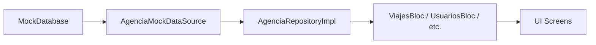

# Guía del Mock Database - Sistema de Datos de Simulación

## 📋 Tabla de Contenidos

1. [Introducción](#introducción)
2. [Arquitectura del Mock Database](#arquitectura-del-mock-database)
3. [Estructura de Datos](#estructura-de-datos)
4. [Inyección de Dependencias](#inyección-de-dependencias)
5. [Cómo Añadir Nuevos Datos](#cómo-añadir-nuevos-datos)
6. [Ejemplos Prácticos](#ejemplos-prácticos)
7. [Mejores Prácticas](#mejores-prácticas)

---

## Introducción

El **Mock Database** es un sistema de simulación de datos que permite desarrollar y probar la aplicación sin necesidad de un backend real. Utiliza el patrón **Singleton** y sigue los principios de **Clean Architecture**.

### ¿Por qué usar Mock Data?

- ✅ Desarrollo sin dependencias del backend
- ✅ Testing rápido y confiable
- ✅ Datos consistentes y predecibles
- ✅ Fácil transición a datos reales

---

## Arquitectura del Mock Database

### Patrón Singleton

```dart
class MockDatabase {
  static final MockDatabase _instance = MockDatabase._internal();
  factory MockDatabase() => _instance;
  MockDatabase._internal();
}
```

**Ventajas:**
- Una sola instancia en toda la aplicación
- Estado compartido entre todos los componentes
- Fácil acceso desde cualquier lugar

### Ubicación en Clean Architecture

```
lib/
├── domain/
│   └── entities/          # Entidades puras (Viaje, Guia, Turista, etc.)
├── data/
│   ├── datasources/       # Interfaces y implementaciones
│   │   └── agencia_mock_data_source.dart  # ← Usa MockDatabase
│   └── repositories/      # Implementaciones de repositorios
│       └── agencia_repository_impl.dart   # ← Llama al DataSource
└── core/
    └── mock/
        └── mock_database.dart  # ← AQUÍ está el Mock Database
```

---

## Estructura de Datos

### Entidades Principales

El Mock Database contiene 4 tipos principales de datos:

#### 1. **Guías** (`List<Guia>`)

```dart
final List<Guia> _guias = [
  const Guia(
    id: 'G-01',
    nombre: 'Marcos Ruiz',
    status: 'EN_RUTA',      // Estados: EN_RUTA, ONLINE, OFFLINE
    viajesAsignados: 1,
  ),
];
```

**Campos:**
- `id`: Identificador único (ej: 'G-01', 'G-02')
- `nombre`: Nombre completo del guía
- `status`: Estado actual del guía
- `viajesAsignados`: Número de viajes activos

---

#### 2. **Viajes** (`List<Viaje>`)

```dart
final List<Viaje> _viajes = [
  const Viaje(
    id: '204',
    destino: 'Centro Histórico CDMX',
    estado: 'EN_CURSO',     // Estados: EN_CURSO, PROGRAMADO, FINALIZADO
    turistas: 15,
    latitud: 19.4326,
    longitud: -99.1332,
  ),
];
```

**Campos:**
- `id`: Identificador único (ej: '204', '205')
- `destino`: Nombre del destino turístico
- `estado`: Estado del viaje
- `turistas`: Número total de turistas
- `latitud/longitud`: Coordenadas GPS

---

#### 3. **Turistas** (`List<Turista>`)

```dart
final List<Turista> _turistas = [
  const Turista(
    id: 'T-01',
    nombre: 'Ana Gómez',
    viajeId: '204',         // ← Relación con Viaje
    status: 'SOS',          // Estados: OK, SOS, ADVERTENCIA
    bateria: 0.15,          // 0.0 a 1.0 (15%)
    enCampo: true,
  ),
];
```

**Campos:**
- `id`: Identificador único (ej: 'T-01', 'T-205-01')
- `nombre`: Nombre del turista
- `viajeId`: **CLAVE FORÁNEA** - ID del viaje al que pertenece
- `status`: Estado de seguridad
- `bateria`: Nivel de batería (0.0 = 0%, 1.0 = 100%)
- `enCampo`: Si está actualmente en el viaje

---

#### 4. **Logs de Auditoría** (`List<LogAuditoria>`)

```dart
final List<LogAuditoria> _logs = [
  LogAuditoria(
    id: 'LOG-9021',
    fecha: DateTime.now().subtract(const Duration(minutes: 2)),
    nivel: 'CRITICO',       // Niveles: CRITICO, ADVERTENCIA, INFO
    actor: 'Sistema',
    accion: 'Detectado patrón de pánico en Turista T-01',
    ip: '192.168.1.10',
    metadata: {             // ← Datos técnicos extra (opcional)
      'bpm': 140,
      'bateria': '15%',
      'coords': '19.4326, -99.1332',
    },
    relatedRoute: '/viajes/204',  // ← Navegación inteligente (opcional)
  ),
];
```

**Campos:**
- `id`: Identificador único (ej: 'LOG-9021')
- `fecha`: Timestamp del evento
- `nivel`: Severidad del log
- `actor`: Quién realizó la acción
- `accion`: Descripción de lo que pasó
- `ip`: Dirección IP o fuente
- `metadata`: Mapa con datos técnicos adicionales
- `relatedRoute`: Ruta para navegación contextual

---

## Inyección de Dependencias

### Flujo de Datos: Mock → DataSource → Repository → BLoC → UI



### 1. **DataSource** - Capa de Acceso a Datos

**Archivo:** `lib/data/datasources/agencia_mock_data_source.dart`

```dart
class AgenciaMockDataSourceImpl implements AgenciaDataSource {
  final MockDatabase _mockDb = MockDatabase();

  @override
  Future<List<Viaje>> getViajes() async {
    return await _mockDb.getViajes();
  }

  @override
  Future<List<Turista>> getTuristasByViajeId(String viajeId) async {
    return await _mockDb.getTuristasByViajeId(viajeId);
  }

  @override
  Future<List<LogAuditoria>> getAuditLogs() async {
    return await _mockDb.getAuditLogs();
  }
}
```

**Responsabilidad:** Obtener datos del Mock Database y retornarlos como entidades.

---

### 2. **Repository** - Capa de Lógica de Negocio

**Archivo:** `lib/data/repositories/agencia_repository_impl.dart`

```dart
class AgenciaRepositoryImpl implements AgenciaRepository {
  final AgenciaDataSource dataSource;

  AgenciaRepositoryImpl({required this.dataSource});

  @override
  Future<Either<Failure, List<Viaje>>> getViajes() async {
    try {
      final viajes = await dataSource.getViajes();
      return Right(viajes);
    } catch (e) {
      return Left(ServerFailure());
    }
  }

  @override
  Future<Either<Failure, List<LogAuditoria>>> getAuditLogs() async {
    try {
      final logs = await dataSource.getAuditLogs();
      return Right(logs);
    } catch (e) {
      return Left(ServerFailure());
    }
  }
}
```

**Responsabilidad:** Manejo de errores con `Either<Failure, T>` de Dartz.

---

### 3. **BLoC** - Gestión de Estado

**Archivo:** `lib/presentation_agencia/blocs/auditoria/auditoria_bloc.dart`

```dart
class AuditoriaBloc extends Bloc<AuditoriaEvent, AuditoriaState> {
  final AgenciaRepository repository;

  AuditoriaBloc({required this.repository}) : super(AuditoriaInitial()) {
    on<LoadAuditoriaEvent>(_onLoadAuditoria);
  }

  Future<void> _onLoadAuditoria(
    LoadAuditoriaEvent event,
    Emitter<AuditoriaState> emit,
  ) async {
    emit(AuditoriaLoading());

    final result = await repository.getAuditLogs();

    result.fold(
      (failure) => emit(const AuditoriaError("Error cargando logs")),
      (logs) => emit(AuditoriaLoaded(logs: logs)),
    );
  }
}
```

**Responsabilidad:** Coordinar la obtención de datos y emitir estados para la UI.

---

## Cómo Añadir Nuevos Datos

### Proceso Paso a Paso

#### **Paso 1: Añadir Viaje**

```dart
// En mock_database.dart, dentro de _viajes
const Viaje(
  id: '206',                          // ← ID único
  destino: 'Pirámides de Teotihuacán',
  estado: 'PROGRAMADO',
  turistas: 12,
  latitud: 19.6925,
  longitud: -98.8439,
),
```

---

#### **Paso 2: Añadir Turistas para ese Viaje**

```dart
// En mock_database.dart, dentro de _turistas
// IMPORTANTE: Añadir después de los turistas del viaje anterior

// --- Grupo Viaje 206 (12 pax) ---
const Turista(
  id: 'T-206-01',                     // ← Patrón: T-{viajeId}-{número}
  nombre: 'Carlos Ramírez',
  viajeId: '206',                     // ← DEBE coincidir con el ID del viaje
  status: 'OK',
  bateria: 0.85,
  enCampo: true,
),
const Turista(
  id: 'T-206-02',
  nombre: 'Laura Martínez',
  viajeId: '206',
  status: 'OK',
  bateria: 0.90,
  enCampo: true,
),
// ... repetir hasta completar 12 turistas
```

> **⚠️ IMPORTANTE:** El número de turistas debe coincidir con el campo `turistas` del viaje.

---

#### **Paso 3: Añadir Alertas (Opcional)**

```dart
// En mock_database.dart, dentro de _alertas
Alerta(
  id: 'A-05',
  viajeId: '206',                     // ← Relacionado con el viaje
  nombreTurista: 'Carlos Ramírez',
  tipo: 'BATERIA',                    // Tipos: PANICO, LEJANIA, BATERIA, CONECTIVIDAD
  hora: DateTime.now().subtract(const Duration(hours: 2)),
  esCritica: false,
  mensaje: 'BATERÍA BAJA - Carlos R. tiene 20% de batería',
),
```

---

#### **Paso 4: Asignar Guía (Opcional)**

Si el viaje está `EN_CURSO`, asigna un guía:

```dart
// En mock_database.dart, dentro de _guias
// Actualizar un guía existente:
const Guia(
  id: 'G-04',
  nombre: 'Luisa Lane',
  status: 'EN_RUTA',                  // ← Cambiar de OFFLINE a EN_RUTA
  viajesAsignados: 1,                 // ← Incrementar contador
),
```

---

#### **Paso 5: Añadir Logs de Auditoría (Opcional)**

```dart
// En mock_database.dart, dentro de _logs
LogAuditoria(
  id: 'LOG-9022',
  fecha: DateTime.now().subtract(const Duration(minutes: 30)),
  nivel: 'INFO',
  actor: 'Admin: Juan',
  accion: 'Creación de viaje #206 a Teotihuacán',
  ip: '192.168.1.15',
  metadata: {
    'trip_id': '206',
    'num_tourists': 12,
    'guide_assigned': 'G-04',
  },
  relatedRoute: '/viajes/206',        // ← Permite navegar al viaje desde el log
),
```

---

## Ejemplos Prácticos

### Ejemplo 1: Añadir un Viaje Completo (Viaje 207)

```dart
// 1. VIAJE
const Viaje(
  id: '207',
  destino: 'Xochimilco - Trajineras',
  estado: 'EN_CURSO',
  turistas: 6,
  latitud: 19.2951,
  longitud: -99.0989,
),

// 2. TURISTAS (6 personas)
const Turista(id: 'T-207-01', nombre: 'Miguel Ángel', viajeId: '207', status: 'OK', bateria: 0.75, enCampo: true),
const Turista(id: 'T-207-02', nombre: 'Gabriela S.', viajeId: '207', status: 'OK', bateria: 0.80, enCampo: true),
const Turista(id: 'T-207-03', nombre: 'Ricardo P.', viajeId: '207', status: 'OK', bateria: 0.70, enCampo: true),
const Turista(id: 'T-207-04', nombre: 'Daniela L.', viajeId: '207', status: 'OK', bateria: 0.65, enCampo: true),
const Turista(id: 'T-207-05', nombre: 'Fernando C.', viajeId: '207', status: 'ADVERTENCIA', bateria: 0.25, enCampo: true),
const Turista(id: 'T-207-06', nombre: 'Valeria M.', viajeId: '207', status: 'OK', bateria: 0.85, enCampo: true),

// 3. ALERTA
Alerta(
  id: 'A-06',
  viajeId: '207',
  nombreTurista: 'Fernando C.',
  tipo: 'BATERIA',
  hora: DateTime.now().subtract(const Duration(minutes: 10)),
  esCritica: false,
  mensaje: 'BATERÍA BAJA - Fernando C. tiene 25% de batería',
),

// 4. GUÍA (Actualizar uno existente)
const Guia(
  id: 'G-05',
  nombre: 'Carlos V.',
  status: 'EN_RUTA',
  viajesAsignados: 1,
),

// 5. LOG
LogAuditoria(
  id: 'LOG-9023',
  fecha: DateTime.now().subtract(const Duration(hours: 1)),
  nivel: 'ADVERTENCIA',
  actor: 'Sistema',
  accion: 'Batería baja detectada en turista Fernando C.',
  ip: 'Sistema Automático',
  metadata: {'tourist_id': 'T-207-05', 'battery_level': '25%'},
  relatedRoute: '/viajes/207',
),
```

---

## Mejores Prácticas

### ✅ DO - Hacer

1. **Mantener Consistencia en IDs**
   ```dart
   // Viaje: '205'
   // Turistas: 'T-205-01', 'T-205-02', ...
   // Alertas: 'A-03', 'A-04', ...
   // Logs: 'LOG-9021', 'LOG-9022', ...
   ```

2. **Usar Timestamps Relativos**
   ```dart
   fecha: DateTime.now().subtract(const Duration(hours: 2))
   // ✅ Siempre será "hace 2 horas" sin importar cuándo se ejecute
   ```

3. **Relacionar Datos Correctamente**
   ```dart
   // Turista DEBE tener viajeId que exista en _viajes
   viajeId: '204'  // ✅ Existe en _viajes
   ```

4. **Metadata Rica en Logs**
   ```dart
   metadata: {
     'bpm': 140,
     'coords': '19.4326, -99.1332',
     'device_id': 'ANDROID-X82',
   }
   ```

---

### ❌ DON'T - Evitar

1. **IDs Duplicados**
   ```dart
   // ❌ MAL
   const Viaje(id: '204', ...)
   const Viaje(id: '204', ...)  // ← Duplicado!
   ```

2. **Referencias Rotas**
   ```dart
   // ❌ MAL
   const Turista(viajeId: '999', ...)  // ← Viaje '999' no existe
   ```

3. **Timestamps Fijos**
   ```dart
   // ❌ MAL
   fecha: DateTime(2026, 1, 25, 10, 42)  // ← Quedará obsoleto
   
   // ✅ BIEN
   fecha: DateTime.now().subtract(const Duration(minutes: 5))
   ```

4. **Números Inconsistentes**
   ```dart
   // ❌ MAL
   const Viaje(id: '205', turistas: 8, ...)
   // Pero solo hay 5 turistas con viajeId: '205' en _turistas
   ```

---

## Verificación de Datos

### Checklist antes de Commit

- [ ] Todos los IDs son únicos
- [ ] Todos los `viajeId` en turistas existen en `_viajes`
- [ ] El número de turistas coincide con el campo `turistas` del viaje
- [ ] Los guías con `viajesAsignados > 0` tienen `status: 'EN_RUTA'`
- [ ] Los timestamps usan `DateTime.now().subtract()`
- [ ] Los logs con `relatedRoute` apuntan a viajes existentes
- [ ] La metadata de logs es relevante y útil

---

## Transición a Datos Reales

Cuando el backend esté listo:

1. **Crear `AgenciaApiDataSource`**
   ```dart
   class AgenciaApiDataSourceImpl implements AgenciaDataSource {
     final http.Client client;
     
     @override
     Future<List<Viaje>> getViajes() async {
       final response = await client.get(Uri.parse('$baseUrl/viajes'));
       // Parse JSON y retornar List<Viaje>
     }
   }
   ```

2. **Cambiar la Inyección de Dependencias**
   ```dart
   // Antes (Mock)
   final dataSource = AgenciaMockDataSourceImpl();
   
   // Después (API Real)
   final dataSource = AgenciaApiDataSourceImpl(client: http.Client());
   ```

3. **¡Listo!** El resto del código (Repository, BLoC, UI) no cambia.

---

## Resumen

- 📦 **Mock Database** = Singleton con listas de entidades
- 🔗 **Relaciones** = `viajeId` conecta turistas con viajes
- 🎯 **Clean Architecture** = DataSource → Repository → BLoC → UI
- ➕ **Añadir Datos** = Viaje → Turistas → Alertas → Guía → Logs
- ✅ **Consistencia** = IDs únicos, referencias válidas, timestamps relativos

---

**¿Necesitas ayuda?** Revisa los ejemplos en `mock_database.dart` o consulta esta guía. 🚀
