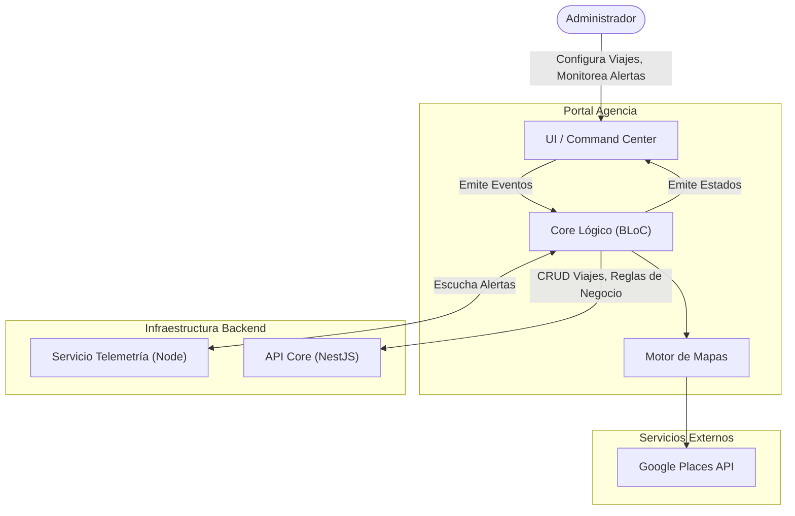
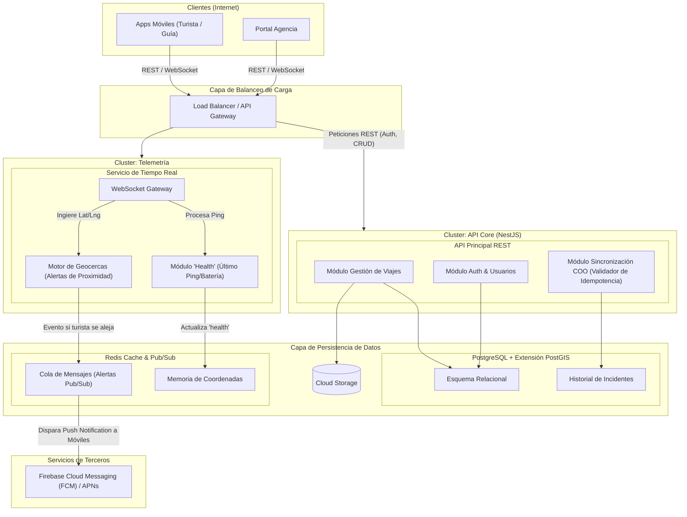
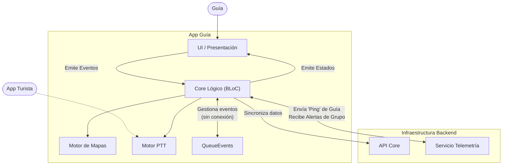
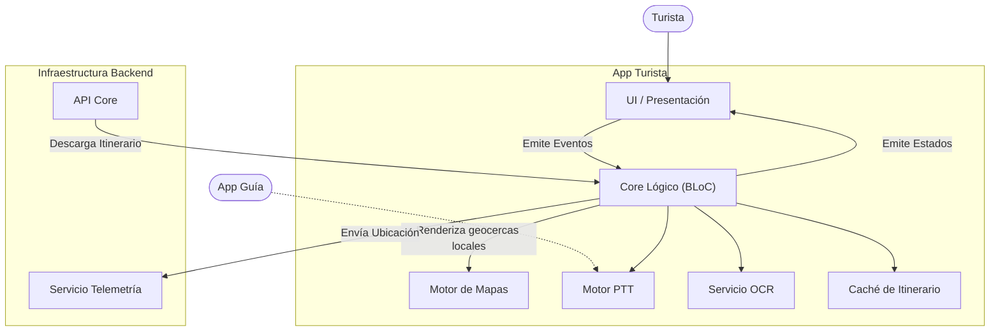

# Documento de Arquitectura de Software

**Proyecto:** Othliani-project (InnovaTec-2026)  
**Fecha:** Marzo 2026  

## 1. Introducción

### 1.1 Propósito
Este documento define la arquitectura base para **ohtliani-project**, un ecosistema de aplicaciones diseñado para centralizar la gestión de viajes, garantizar respuesta a incidentes y mejorar la logística de agencias turísticas.

### 1.2 Alcance del Sistema
El ecosistema consta de tres plataformas principales:

1. **App Turista (Móvil):** Enfoque en UX fluida, mapa personal, alertas de proximidad, PTT (Walkie-Talkie) y herramientas offline (Conversor OCR).
2. **App Guía (Móvil):** Enfoque en operación a una mano, mitigación de riesgos, control de grupo, pase de lista digital y sincronización táctica (COO).
3. **Portal Agencia (Escritorio):** Enfoque en monitoreo táctico, gestión de flotas, configuración de reglas de negocio y analítica.

## 2. Atributos de Calidad y Restricciones

Para asegurar el éxito del sistema, la arquitectura debe satisfacer los siguientes Requerimientos No Funcionales:  

* **Disponibilidad y Resiliencia:** El sistema debe permitir a los guías registrar incidentes y a los turistas usar herramientas (itinerario, conversor) sin conexión a internet. Sincronización automática al recuperar red.
* **Seguridad y Privacidad:** Minimización de datos (recolectar solo lo estrictamente necesario de la ubicación del turista). Las cuentas deben poder eliminarse permanentemente. El rastreo de ubicación solo debe estar activo durante las fechas y horas del viaje.  
* **Escalabilidad:** El MVP debe soportar hasta cientos de viajes simultáneos con un costo de infraestructura manejable, escalable horizontalmente.
* **Eficiencia de Batería:** El rastreo de ubicación en background debe estar optimizado para no drenar la batería del turista/guía.

## 3. Vista de Contenedores

### 3.1 Aplicaciones Móviles (Turista & Guía)
* **Framework:** Flutter (Dart) para iOS y Android.
* **Gestión de Estado:** BLoC (Business Logic Component) consumido desde el paquete core compartido.  
* **Mapas (Orientado a COO):** Mapbox SDK o flutter_map (OpenStreetMap). Prioridad absoluta a la capacidad de cachear tiles y renderizar vectores de mapas de forma 100% offline.  
* **Base de Datos Local:** Isar Database. Extremadamente rápida para persistir itinerarios e incidentes localmente.
* **Comunicaciones PTT:** WebRTC (para voz en tiempo real) + WebSocket para señalización.  
* **Machine Learning Local:** Google ML Kit (On-Device) para el OCR del conversor de divisas.  

### 3.2 Aplicación de Escritorio (Agencia)
* **Framework:** Flutter Desktop (Dart) para Windows y macOS.
* **Gestión de Estado:** BLoC. 
* **Mapas (Orientado a UX):** Integración con Google Maps API (Maps & Places). Prioridad a la búsqueda semántica, geocoding para creación de itinerarios y visualización de alto rendimiento con conexión a internet garantizada.

### 3.3 Backend (API y Servicios de Tiempo Real)
* **Framework Principal:** Node.js con NestJS. Estructura fuertemente tipada.
* **Microservicio de Telemetría/Ubicación:** Un servicio dedicado en Node.js (Socket.io/gRPC) exclusivo para ingerir las coordenadas (Ping) y procesar alertas de proximidad en memoria.

### 3.4 Bases de Datos e Infraestructura
* **Base de Datos Principal:** PostgreSQL con extensión PostGIS para cálculos de geolocalización (geofencing).
* **Caché y Pub/Sub:** Redis. Para manejar el "Último Ping" y distribuir mensajes rápidamente.
* **Almacenamiento:** AWS S3 / Google Cloud Storage.

## 4. Estrategias Arquitectónicas Clave

### 4.1 Patrón de Sincronización Offline
Dado que los destinos pueden ser remotos:
1. **Event Sourcing Local:** Acciones de campo se guardan localmente en QueueEvents con un UUID.  
2. **Idempotencia:** Al detectar red, el backend usa el UUID para asegurar que un incidente no se duplique.  
3. **Conflict Resolution:** "El dispositivo del guía manda". Las acciones críticas de seguridad sobrescriben el estado del servidor basado en el timestamp de generación.

### 4.2 Motor de Alertas de Proximidad
1. Guía envía ubicación a Redis cada 15 segundos.
2. Turista envía su ubicación.
3. El Backend de Telemetría cruza coordenadas. Si la distancia excede la regla de negocio, dispara un evento por WebSocket para notificaciones Push e interfaz de escritorio.

### 4.3 Estrategia Híbrida de Mapas
Para equilibrar la facilidad de uso del administrador y la resiliencia offline en campo, el sistema implementa múltiples motores de renderizado espacial bajo una misma capa lógica:
* **Capa Core (Agnóstica):** Los BLoCs de dominio únicamente entienden coordenadas crudas (Latitud, Longitud), radios de geocercas (metros) y metadatos del hito. No saben qué mapa se está usando.
* **Capa de Presentación Agencia (Online):** Consume la capa core y la renderiza sobre Google Maps, permitiendo al administrador usar Places API para autocompletar búsquedas (ej. "Museo del Prado") y crear itinerarios sin fricción de coordenadas.
* **Capa de Presentación Campo (Offline):** Consume la misma capa core, pero la renderiza sobre Mapbox/OSM. Las coordenadas del itinerario creado por la agencia se descargan al móvil antes del viaje, permitiendo renderizar el mapa táctico de seguridad incluso sin señal celular.  

### 4.4 Cumplimiento GDPR (Minimización de Datos)
* **Soft Deletion:** Las rutas históricas exactas no se guardan a largo plazo. Solo se mantiene un log temporal en Redis.
* **Auditoría Estricta:** Las ubicaciones solo se persisten en base de datos si ocurre un "Trigger de Incidente", sujeto a un TTL de retención legal para posterior anonimización.

## 5. Vista de Componentes Gráfica

### 5.1 Arquitectura de Componentes - App Agencia (Escritorio)

### 5.2 Arquitectura de Componentes - Backend y Cloud

### 5.3 Arquitectura de Componentes - App Guía (Móvil)

### 5.4 Arquitectura de Componentes - App Turista (Móvil)

